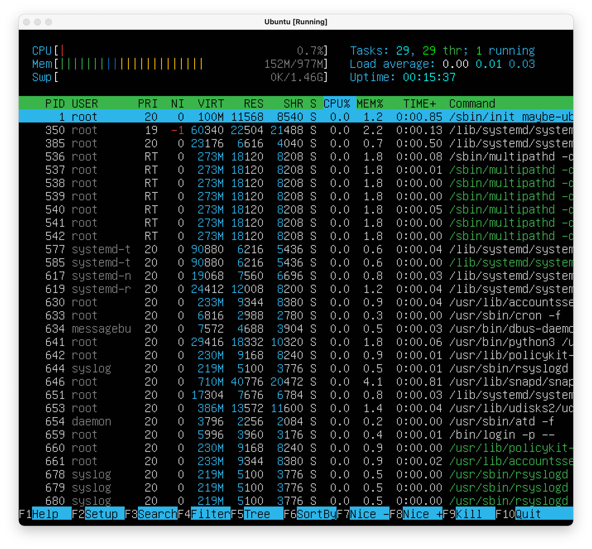
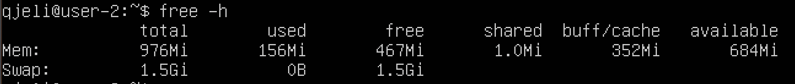
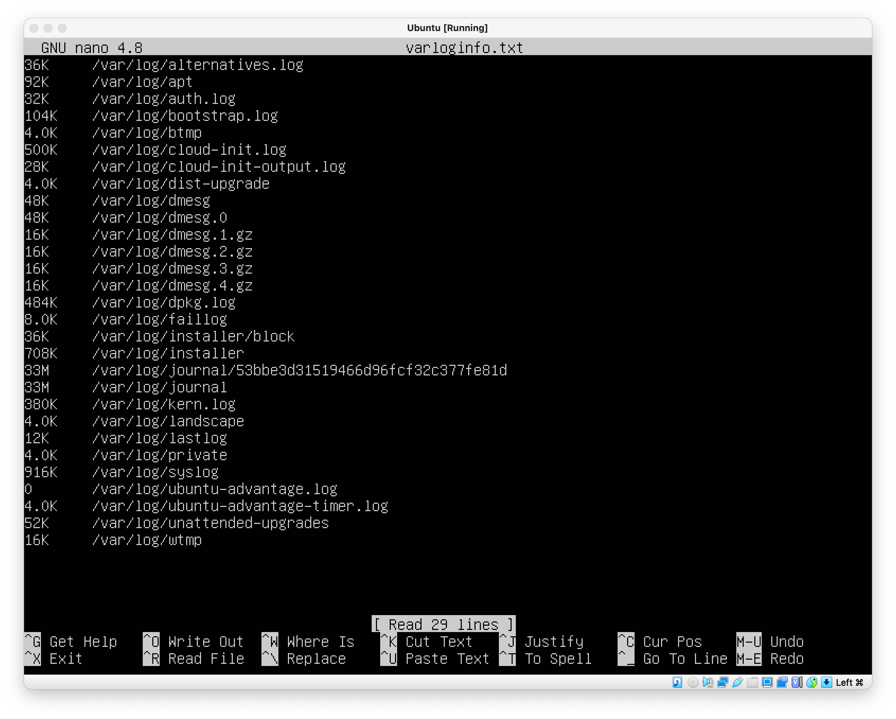
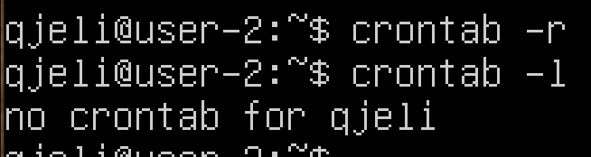

## Part 1. Installation of the OS

Installing a Ubuntu server and setting it in VirtualBox

1.1 Checking Ubuntu version by running a command 'cat /etc/issue'

## Part 2. Creating a user

Creating a user other than the one created during installation. Than adding a user to a 'adm' group

2.1 To add a new user to the 'adm' group, we need to run a command 'sudo useradd -g users -G adm cyndisig}'

2.2 Checking an output of a command 'cat /etc/passwd'. Our new user will be there if everything is done right

## Part 3. Setting up the OS network

3.1. Setting the machine name as user-1 can be done using the command 'sudo nano /etc/hostname'

Checking new hostname using a command 'cat /etc/hostname'

3.2 Set the time zone corresponding to your current location

First we check our current time using a command 'timedatectl'
Then we change our time from 'UTC' to 'MSK' using a command 'sudo timedatectl set-timezone Europe/Moscow'
Lastly, we are checking if our timezone has changed using the same command 'timedatectl'

3.3 Output the names of the network interfaces using a console command

To output the names of networks interfaces we need to use a command 'ifconfig' but firstly we need to install a tools for network using a command 'sudo apt install net-tools'

enp0s3 - is an interface that monitors outside networks

lo - The loopback device is a special, virtual network interface that your computer uses to communicate with itself. It is used mainly for diagnostics and troubleshooting, and to connect to servers running on the local machine

3.4 Use the console command to get the ip address of the device you are working on from the DHCP server

Dynamic Host Configuration Protocol (DHCP) is a network management protocol used to automate the process of configuring devices on IP networks, thus allowing them to use network services such as DNS, NTP, and any communication protocol based on UDP or TCP. A DHCP server dynamically assigns an IP address and other network configuration parameters to each device on a network so they can communicate with other IP networks. DHCP is an enhancement of an older protocol called BOOTP. DHCP is an important part of the DDI solution (DNS-DHCP-IPAM).

Using a command 'ip address' we're getting an ip address of a device

3.5 Define and display the external ip address of the gateway (ip) and the internal IP address of the gateway, aka default ip address (gw)

Using a command 'ip-route' we're displaying a internal IP address of the gateway, aka default IP address(gw)

To display a external IP address we need to use a command 'curl http://ipinfo.io/ip', we're connecting to a external site to show our IP address

3.6 Set static (manually set, not received from DHCP server) ip, gw, dns settings (use public DNS servers, e.g. 1.1.1.1 or 8.8.8.8)

To configure a static IP address on your Ubuntu server you need to find and modify a relevant netplan network configuration file:

We're openning this file in nano, but we're using a 'sudo nano' for this file to make sure we have rights to change this file. Then we're changing 'dhcp4' to 'false' and adding several new lines in the code, IP address is from 'ip address' command, gateway is from 'ip route' command, nameservers are from task, e.g. '1.1.1.1' or '8.8.8.8'

To apply our new configuration we need to use command 'sudo netplan apply' and 'sudo netplan try'

3.7 Reboot the virtual machine. Make sure that the static network settings (ip, gw, dns) correspond to those set in the previous point.

To reboot Virtual Machine we're using a command 'reboot' and then we check if our changes was saved

Checking an output of a 'ip route' command. Changes should be visible and we should see our static ip

Then we're checking our dns-servers using 'systemd-resolve --status' command

To make sure everything was done right we're using a command 'ping'

## Part 4. OS Update

4.1 Update the system packages to the latest version

To update the repositories we're using a command 'sudo apt update'

To update the packages we're using a command 'sudo apt dist-upgrade'
Inputing the same command we're seeing that there are no more upgrades

## Part 5. Using the sudo command

5.1 Allow user created in Part 2 to execute sudo command.

Sudo stands for either "substitute user do" or "super user do" and it allows you to temporarily elevate your current user account to have root privileges. This is different from “su” which is not temporary

To allow a user to execute the sudo command, you need to add him to the sudo group. To do this, on behalf of the administrator, run the usermod command with the options -a (--append, adds the user to additional groups) and -G (--groups, list of additional groups).

To change the user, enter the command 'su - <username>'. Before that, set a password for the user created in Part 2 using the 'sudo passwd <username>' command

After changing the user, edit /etc/hostname.

We restart the virtual machine. The changes have been applied.

## Part 6. Installing and configuring the time service

To enable automatic time synchronization, you need to enter the command sudo timedatectl set-ntp on.

## Part 7. Installing and using text editors

Install VIM text editor (+ any two others if you like NANO, MCEDIT, JOE etc.)

The VIM and NANO editors are already installed. Install JOE with 'sudo apt install joe' command:

'VIM'

7.1.1 Editing + saving

Press i to enter insert mode, enter nickname, press Esc to exit insert mode, type :wq

7.1.2 Exit without saving

To exit without saving, enter :q!

7.1.3 Search and replace

To search, press / and type the word you are looking for, then press Enter. n - go to the next occurrence of the search string. Replacement command: :[number of lines to process]s/{replacement}/{replacement}/[flags] [number of replacements]. To replace all 21 with 42 I typed :s/21/School/g

'NANO'

7.2.1 Editing + saving

Press Ctrl+O to save, press Ctrl+X to exit

7.2.2 Exit without saving

To exit without saving, press Ctrl + X, then N

7.2.3 Search and replace

To search, press Ctrl+W, Enter. To replace, enter the replacement word in the search mode, press Ctrl + R, enter the replacement word and press Enter. At each occurrence of the search word, nano will ask if it should be replaced. Y - yes, N - no, A - replace all at once

'JOE'

7.3.1 Editing + saving

To exit - Ctrl+K+Q, then y to save

7.3.2 Exit without saving

To exit - Ctrl+K+Q, then n to undo changes

7.3.3 Search and replace

To search, you need to press Ctrl + K + F, enter the search string and press Enter twice. The search will start from the position where the cursor is. To replace, press Ctrl + K + F, Enter, then R, enter the replacement word and press Enter. Like nano, joe will ask whether to change each occurrence of the searched string. Y - yes, N - no, R - replace all at once. Replacement starts from the position where the cursor is

## Part 8. Installing and basic setup of the SSHD service

Install the SSH server with the command 'sudo apt install openssh-server'

The SSH server was installed during the initial installation of the system.
Let's add the SSH server to startup with the 'sudo systemctl enable ssh' command

Now we need to configure our ssh server to connect to the machine remotely. We edit the /etc/ssh/sshd_config file, specifying the desired number opposite the word Port. 'sudo nano /etc/ssh/sshd_config'. By default, lines are written as comments, with the # symbol. It needs to be removed. The default port is 22, we change it to 2022 - as it is said in the task. We save and exit.

Use the ps command to show the presence of the sshd process.

ps (from English process status) is a program in UNIX, Unix-like and other POSIX-compatible operating systems that displays a report on running processes. The -A switch allows you to select all processes for the report. Using the grep utility, it is convenient to search for and display only the processes you need.

netstat (network statistics) is a command-line utility that displays the status of TCP connections (both incoming and outgoing), routing tables, number of network interfaces, and network protocol statistics. The main purpose of the utility is to find network problems and determine network performance.

Key values:

- -t - show only TCP ports.
- -a, --all - Show sockets waiting for a connection and not waiting for a connection.
- n, --numeric Display numeric addresses without attempting to determine a symbolic hostname, port, or username.

Column values:

- Proto - Protocol (tcp, udp, raw) used by the socket.

- Recv-Q - Counter of bytes not copied by the user program from this socket.

- Send-Q - Counter of bytes not acknowledged by the remote host.

- Local Address - Address and port number of the local end of the socket. If the [--numeric|-n] option is not specified, the socket address is converted to a canonical host name (FQDN) and the port number is converted to the corresponding service name. If the [-n|--numeric] option is specified, the output is in the format [socket address:port number]. In the line we are interested in, 0.0.0.0 is the address of the local end of the socket, 2022 is the port number, which we changed from 22 to 2022. The address 0.0.0.0 means that the remote end of the socket will be available to all local ip addresses.

- Foreign Address - Address and port number of the remote end of the socket.

- State - State of the socket. The LISTEN state means that the socket is waiting for incoming connections.

## Part 9. Installing and using the top, htop utilities

Top(Table Of Processes) utility output

- uptime (how long the system is running) - 1 hour 20 minutes
- number of authorized users - 1
- total system load (line load average) - 0.00 (system idle)

- the total number of processes - Tasks: 96 total, and how many of them are sleeping, turned off or become zombies (zombies are completed, but not cleared from memory processes).

- cpu load - %Cpu(s): processor at rest

- memory load - MiB Mem : - RAM load, MiB Swap: - swap file loading. In total, there are 7768.0 mebibytes of RAM (1 mebibyte = 2^20 bytes, 7768.0 mebibytes ≈ 8 gigabytes): of which 153.4 are occupied, 7203.0 are free, 411.6 are occupied by the system cache.

- PID of the process taking up the most memory - 728. You can sort by memory using 'Shift+M'.

- PID of the process taking the most CPU time - 728

htop utility output:

- Sort(F6):

   - by PID:

  
  
  - by PERCENT_CPU:
  
  
  
  - by PERCENT_MEM:

    

  - by TIME:
  
  
  
  
- Filtering (F4 or \) for sshd process:

 

- Search(F3) for syslog process:

 

- With hostname, clock and uptime output (F2 output setting):

 

 ## Part 10. Using the fdisk utility

 We look at the execution of the command 'sudo fdisk -l'

- hard drive name - /dev/sda
- its size and number of sectors
- swap file size 'free -h' will give us the size of our swap file. Since no swap file has been created, the size is zero.

## Part 11. Using the df utility

Root partition (/):

- Information from the df command

- partition size - 8408452

- the size of the occupied space - 4254668

- free space size - 3705068

- percentage of use - 54%

The unit used is kilobytes.

- Information from the df -Th command

- partition size - 8.1 GB

- the size of the occupied space - 4.1 GB

- free space size - 3.6 GB

- percentage of use - 54%

The file system type is ext4.

## Part 12. Using the du utility.

The output of du for /home, /var, /var/log is first in bytes, then in a more readable form.

Size of all content in /var/log.

'sudo du -h /varlog/* > varloginfo.txt; nano varloginfo.txt'

## Part 13. Installing and using the ncdu utility.

- Install the ncdu utility:

'sudo apt install ncdu'

- Run a full system scan by passing ncdu the path to the root partition:

'ncdu /'

- Compare the output of du and ncdu:
 
 |      |  /home  |  /var   | /var/log |
 |------|---------|---------|----------|
 |  du  | 88 KiB  | 688 MiB |  36 MiB  | 
 | ncdu | 96 KiB  | 720 MiB |  69 MiB  |

 ## Part 14. Working with system logs

 - The /var/log/dmesg log contains information about device drivers.

- /var/log/syslog contains the global system log, which contains messages from the Linux kernel, various services, network interfaces, etc. since system startup.

- /var/log/auth.log - information about user authorization, including successful and unsuccessful login attempts, as well as the authentication mechanisms involved.

- Authorization information:

Use 'sudo cat /var/log/auth.log | grep login'

- The last successful authorization was performed on March 14 at 21:51:0 by user user-2. Authorization method LOGIN.

- Restart the SSHd service:

'sudo systemctl restart sshd'

## Part 15. Using the CRON job scheduler.

- Edit the crontab file for the current user:

'crontab -e'

- Add the line */2 * * * * uptime | wall and exit the editor saving the changes.

- View this file:

'crontab -l'

- Every 2 minutes the result of the given task will be displayed on the screen:

- Entries in /var/log/syslog:

- Deleting the configuration file:

'crontab -r'

- Attempt to display a list of tasks after deletion:

